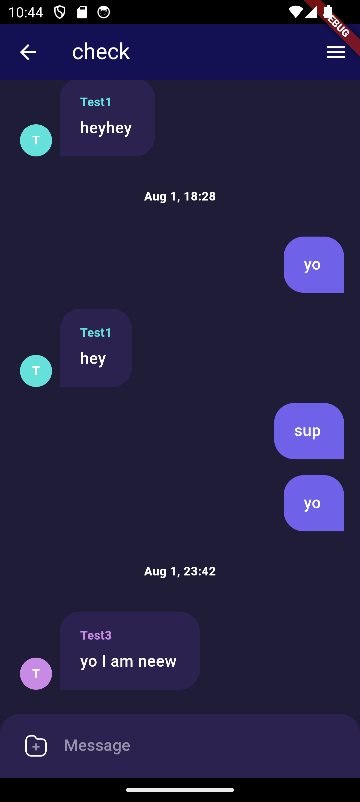
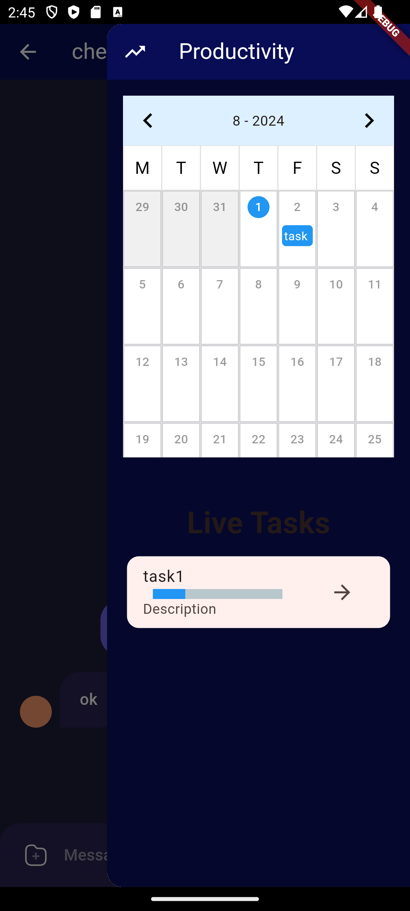
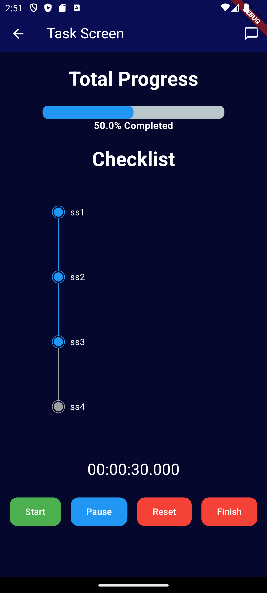
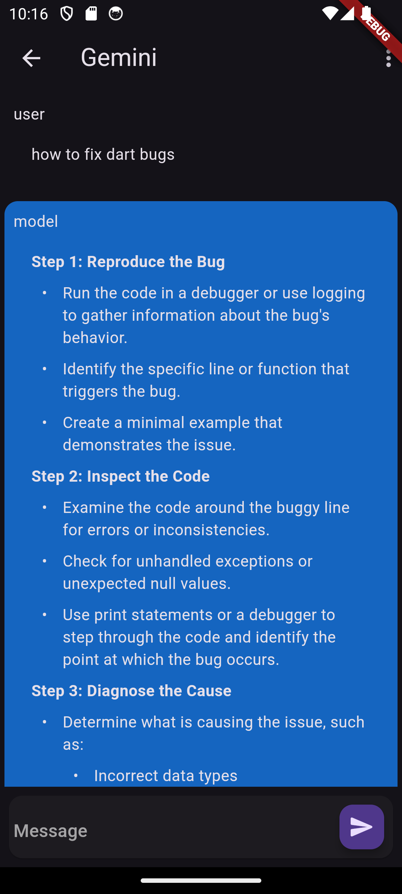
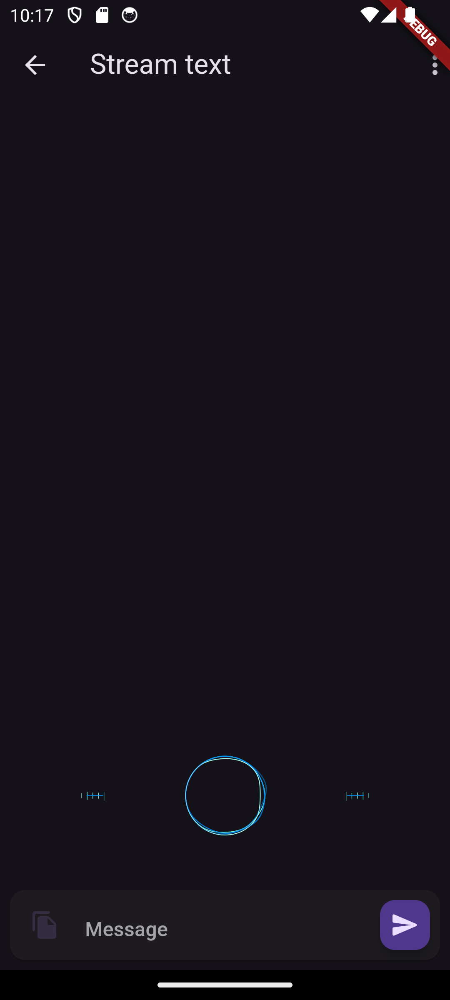
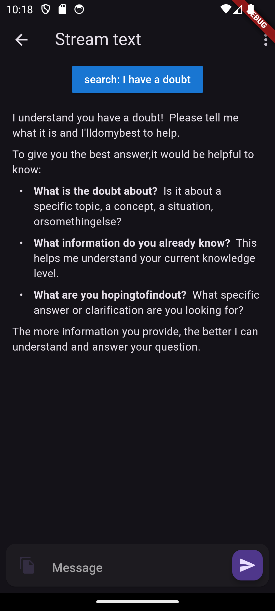

# Stud-Com Frontend Application Documentation

This is the documentation for the WinSpark frontend application. The application is built using Flutter and is designed to connect students who are looking for study partners based on their subjects, schedules, and study preferences.

## Table of Contents

1. [Technical Overview](#technical-overview)
2. [Setup](#setup)
3. [Application Structure](#application-structure)
4. [User Interface](#user-interface)
5. [API Endpoints](#api-endpoints)

## Technical Overview

The frontend application is built using the Flutter framework. It communicates with the backend API to fetch and send data. The application is designed to be cross-platform, with support for both Android and iOS.

## Setup

To set up the application for development, follow these steps:

1. Clone the repository: `git clone https://github.com/Git-Gud-WinSpark/frontend.git`
2. Install Flutter: Follow the instructions on the [Flutter website](https://flutter.dev/docs/get-started/install) to install Flutter.
3. Set up the development environment: Open a terminal and navigate to the `frontend` directory. Run `flutter pub get` to download the required dependencies.
4. Launch the application: Run `flutter run` to launch the application on a connected device or emulator.

## Application Structure

The frontend application is structured as follows:

- `lib/`: Contains the main application code.
  - `main.dart`: The entry point of the application.
  - `screens/`: Contains the different screens of the application.
    - `login_screen.dart`: The login screen.
    - `home_screen.dart`: The home screen.
    - `study_partner_screen.dart`: The study partner screen.
    - `resource_list_screen.dart`: The resource list screen.
    - `resource_upload_screen.dart`: The resource upload screen.
  - `widgets/`: Contains reusable widgets.
    - `user_image_picker.dart`: A widget for picking user images.
  - `services/`: Contains the API service classes.
    - `login.dart`: The login service.
    - `signup.dart`: The signup service.
    - `fetchUser.dart`: The fetch user service.

## User Interface

The frontend application has a clean and intuitive user interface. The screens are designed to provide a seamless user experience.

## API Endpoints

The frontend application communicates with the backend API to fetch and send data. The API endpoints are as follows:
-	POST /signup - Register a new user
-	POST /signin - Authenticate and log in a user
-	POST /api/createCommunity - Create a new community
-	POST /api/createChannel - Create a new channel within a community
-	POST /api/chat - Send a message in a community channel
-	POST /api/getChats - Retrieve chat messages from a community channel
-	POST /api/addCommunity - Add a user to an existing community
-	GET /api/listAllCommunity - List all available communities
-	POST /api/listUserCommunity - List communities a user is part of
-	POST /api/p2pChat - Send a direct message to another user
-	POST /api/getP2PChats - Retrieve direct messages between two users
-	POST /api/listP2PConversations - List all direct message conversations for a user
-	POST /api/fetchUser - Retrieve information about a specific user by ID
-	POST /progressTrack - Create or update progress tracking for tasks
-	POST /progressTrack/getLiveTask - Get current live tasks for a user
-	POST /progressTrack/getSubtask - Get subtasks for a specific task
-	POST /progressTrack/completeTask - Mark a task or subtask as completed
-	POST /api/getUser - Retrieve information about a specific user by username
-	POST /progressTrack/setLiveTask - Set new live tasks for a user
-	POST /progressTrack/setTime - Set time spent on a specific task or subtask

## Screenshots

### Login Page / SignUP Page

### Preference Page

### Private Chats 

### Community

### Channels

### Progress tracker

### Gemini Chat

